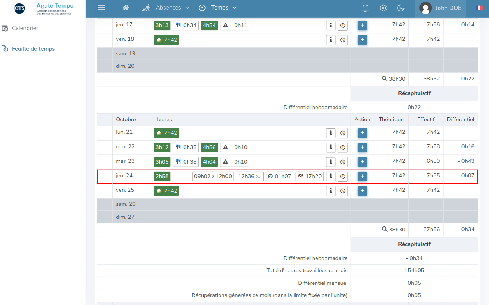

# Agate Made Simple

Agate Made Simple is a browser extension that adds elements to Agate Tempo (the time management software used by the CNRS agents) in order to improve its usability.

## Features

The following changes are applied to the timesheet page :

- Displays the remaining worktime of the current day
- Displays the end-of-day time
- Adds a more accessible button to manage each day's clockings
- Adds an alternative display of the clockings

## Screenshot



## Running in dev mode

1. Install NPM packages

```Shell
npm install
```

2. Run

```Shell
# Chrome/Chromium
npm run dev

# Firefox
npm run dev:firefox
```

**Note:**  
To run the extension with another Chromium-based browser, set the `CHROME_PATH` environment variable with the path to the browser executable. You can also save it in a `.env` file.

Example:
```Shell
CHROME_PATH=/usr/bin/brave-browser
```

## Build for production

The following command builds the extension for production, and generates the ZIP archives to be published on the stores.

```Shell
npm run zip
```

**Note:**  
For the Firefox build, a source ZIP is also generated.


## Recommended IDE Setup

- [VS Code](https://code.visualstudio.com/) + [Volar](https://marketplace.visualstudio.com/items?itemName=Vue.volar)
